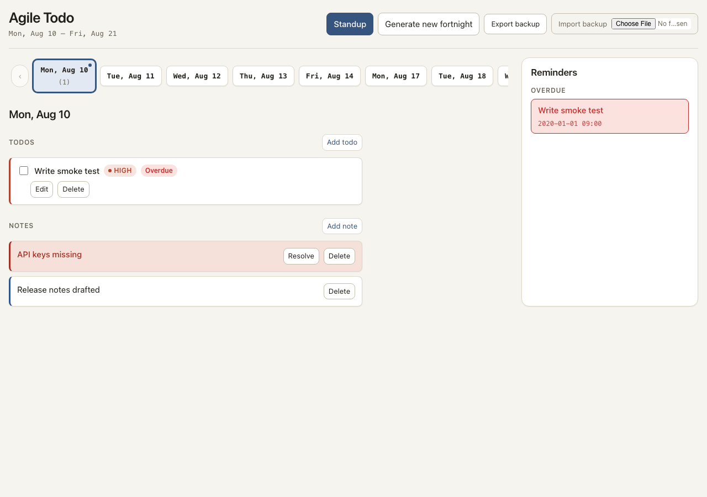

# Agile Todo App

A browser-only todo board built around a two-week sprint. No backend, no accounts, no network calls — everything lives in your browser.

**[Live demo →](https://joanesquivel.github.io/agile-todo-app/)**

89 tests · TypeScript strict · zero backend



## What it does

- **Fortnight board** — a rolling 10-workday (2-week) view, always anchored to the current week
- **Daily rollover** — incomplete todos from past days automatically move forward, flagged as "rolled over"
- **Standup generator** — one click produces a Yesterday/Today/Blockers summary, copyable straight to Slack
- **Visual reminders** — an Overdue/Upcoming panel, no browser notification permissions needed
- **Per-day notes** — flag a `blocker` (resolvable) or leave an `info` note
- **Read-only fortnight history** — generate a new fortnight any time; old ones stay browsable, never editable

## Why it's built this way

- **Browser-only, on purpose.** No backend, no network, no accounts — your data never leaves your device.
- **One versioned JSON document** in `localStorage`, with schema migrations and JSON export/import for backups.
- **A pure, testable domain core.** All the fortnight/rollover/standup date logic lives in framework-free functions that take time as a parameter — no DOM, no mocking, fast tests.
- **Built test-first.** Every feature shipped with tests before the UI did.

## Quick start

Requires Node 20+.

```sh
npm ci
npm run dev
```

Open `http://localhost:5173`.

## Scripts

| Command | Does |
|---|---|
| `npm run dev` | Start the dev server |
| `npm run build` | Production build |
| `npm run preview` | Preview the production build locally |
| `npm test` | Run the test suite (Vitest) |
| `npm run test:watch` | Run tests in watch mode |
| `npm run typecheck` | Type-check the whole project |
| `npm run verify` | typecheck + test — what CI enforces before every deploy |

## Architecture at a glance

```
src/
  domain/      pure functions — date math, fortnight generation, rollover, standup, reminders
  store/       Zustand store — persistence, migrations, backup export/import
  hooks/       React adapters over the store
  components/  UI, organized by feature (board, todos, notes, reminders, standup, history)
  styles/      design tokens + global element defaults
```

Dependencies point one way: `domain → store → components`. The domain layer has zero framework dependencies, which is what makes the date logic unit-testable in isolation.

Full architecture rationale, data model, and edge-case decisions: [`docs/superpowers/specs/2026-08-10-agile-todo-app-design.md`](docs/superpowers/specs/2026-08-10-agile-todo-app-design.md).

## Testing

Vitest + React Testing Library, 89 tests across 23 files, all colocated with the code they test. Coverage spans pure domain logic, store transitions, persistence/migration behavior, component interaction, and accessibility.

```sh
npm test                              # everything
npx vitest run src/domain/dates.test.ts   # one file
```

## Data & privacy

Everything is stored under a single `localStorage` key (`agile-todo-app.v-state`). Nothing is ever sent over the network. Clearing your browser's site data deletes everything — export a JSON backup first if you want to keep it.

## Deployment

GitHub Actions builds, tests, and deploys to GitHub Pages on every push to `main` (see `.github/workflows/deploy.yml`).

## Docs

- [`CLAUDE.md`](CLAUDE.md) — architecture invariants and conventions, for anyone (human or AI) making changes
- [`docs/superpowers/specs/2026-08-10-agile-todo-app-design.md`](docs/superpowers/specs/2026-08-10-agile-todo-app-design.md) — the design spec
- [`docs/TECH-DEBT.md`](docs/TECH-DEBT.md) — known, triaged gaps
- [`docs/ARCHIVE.md`](docs/ARCHIVE.md) — how it was originally built (historical)

## License

MIT — see [`LICENSE`](LICENSE).
